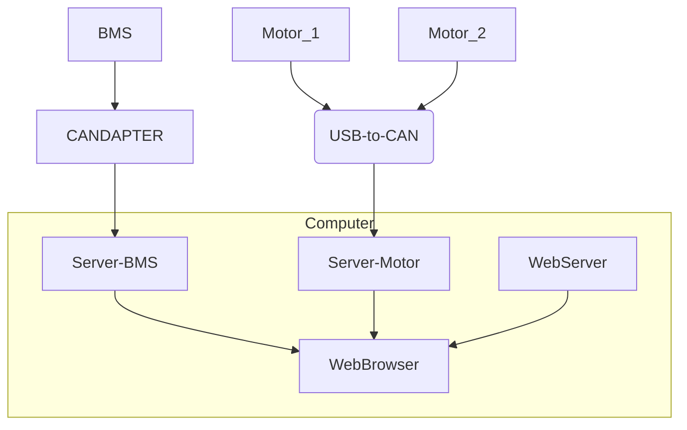

# Porsche 914 - EV Controller
This is a 1976 Porsche that has an EV conversion.

## System Architecture for CAN and web Control

```mermaid
graph TD;
    Motor_1-->IXXAT(USB-to-CAN);
    Motor_2-->IXXAT(USB-to-CAN);
    IXXAT(USB-to-CAN)-->Server-Motor
    BMS-->CANDAPTER;
    CANDAPTER-->Server-BMS


    subgraph Computer
    Server-BMS-->WebBrowser
    Server-Motor-->WebBrowser
    WebServer-->WebBrowser
    end
```