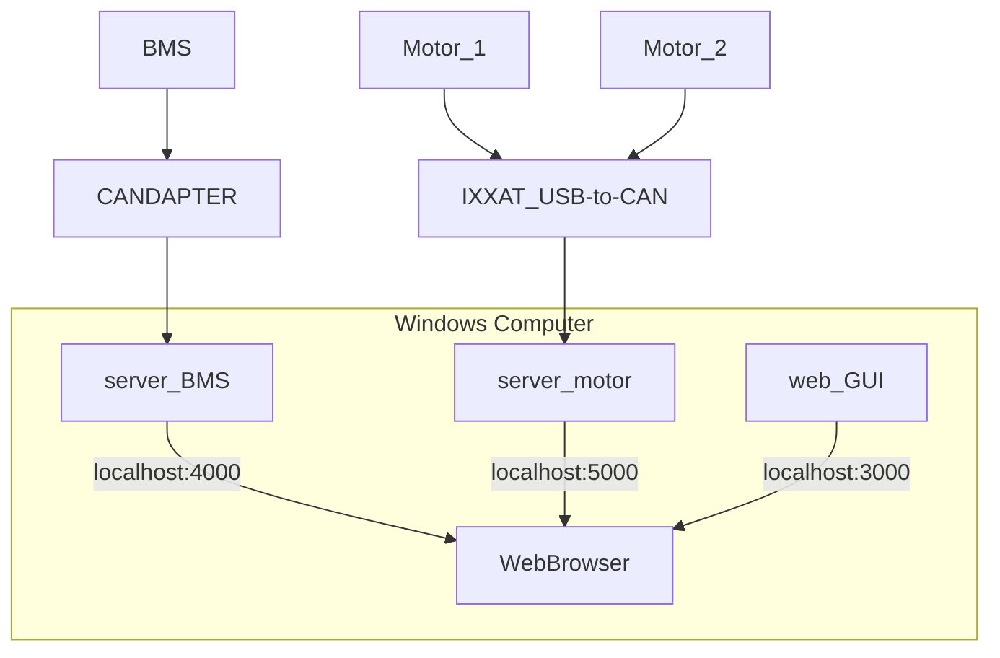

# Porsche 914 - EV Controller
This is a 1976 Porsche that has an EV conversion. The system is quite unique with a convertible top, pickup tuck bed, fully custom rocker suspension, and a chain drive.

## System Architecture (CAN)

## Why are there three servers?
The BMS was written first using Javascript and Express JS. The IXXAT CAN adapter only works with python, so a seperate one was made. It was not sure if the react web app will sit on the device so, it was also seperated.

Created with [Mermaid](https://mermaid-js.github.io/mermaid/#/./flowchart?id=flowcharts-basic-syntax) Markdown.